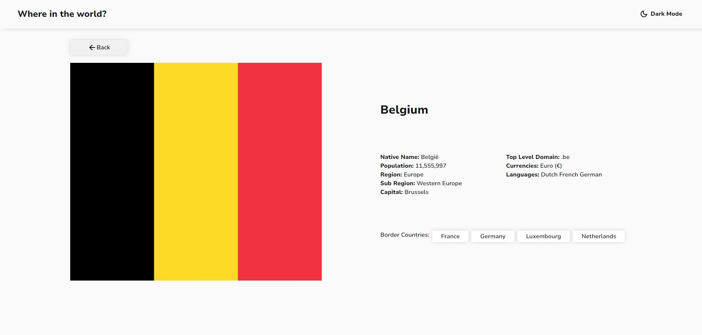

# Frontend Mentor - REST Countries API with color theme switcher solution

This is a solution to the [REST Countries API with color theme switcher challenge on Frontend Mentor](https://www.frontendmentor.io/challenges/rest-countries-api-with-color-theme-switcher-5cacc469fec04111f7b848ca). Frontend Mentor challenges help you improve your coding skills by building realistic projects.

## Table of contents

- [Overview](#overview)
  - [The challenge](#the-challenge)
  - [Screenshot](#screenshot)
  - [Links](#links)
- [My process](#my-process)
  - [Built with](#built-with)
  - [What I learned](#what-i-learned)
  - [Continued development](#continued-development)
  - [Useful resources](#useful-resources)
- [Author](#author)

## Overview

### The challenge

Users should be able to:

- See all countries from the API on the homepage
- Search for a country using an `input` field
- Filter countries by region
- Click on a country to see more detailed information on a separate page
- Click through to the border countries on the detail page
- Toggle the color scheme between light and dark mode _(optional)_

### Screenshot




### Links

- Solution URL: [Frontend Mentor](https://www.frontendmentor.io/solutions/react-vite-rest-countries-TrEzaDv_KN)
- Live Site URL: [Vercel](https://rest-countries-weld-eight.vercel.app/)

## My process

### Built with

- Semantic HTML5 markup
- CSS custom properties
- Flexbox
- CSS Grid
- Mobile-first workflow
- [React](https://reactjs.org/) - JS library
- [Material Ui](https://mui.com/)
- [Vite](https://vitejs.dev/)

### What I learned

I have implemented a search bar that gives options as you type as well as the flag of the country. Filtering by regions is also implemented. I have dark mode that
can be toggled on and off and that value is stored in localStorage and when you refresh it gets that stored value.

```js
useEffect(() => {
  // Apply mode from local storage on component mount
  const storedMode = localStorage.getItem("mode");
  if (storedMode) {
    setMode(storedMode);
    document.body.classList.add(storedMode);
  }
}, [setMode]);
```

```js
<Autocomplete
  data={data}
  freeSolo
  options={filteredData.map((item) => item.name)}
  inputValue={searchInput}
  onInputChange={handleSearchInput}
  getOptionLabel={(option) => option}
  renderOption={(props, option) => {
    const country = data.find((item) => item.name === option);
    if (!country) return null; // Handle cases where country is not found
    return (
      <Box
        component="li"
        sx={{ "& > img": { mr: 2, flexShrink: 0 } }}
        {...props}
      >
        
        {option}
      </Box>
    );
  }}
  sx={{
    width: { xs: "90vw", md: 450 },
    backgroundColor:
      mode === "light"
        ? "var(--lightMode-Elements)"
        : "var(--darkMode-Elements)",
    borderRadius: "5px",
    "& input": {
      color:
        mode === "light" ? "var(--lightMode-Text)" : "var(--darkMode-Text)",
    },
  }}
  renderInput={(params) => (
    <TextField
      {...params}
      label="Search for a country..."
      InputLabelProps={{
        style: {
          color:
            mode === "light" ? "var(--lightMode-Text)" : "var(--darkMode-Text)",
        },
      }}
      InputProps={{
        ...params.InputProps,
        startAdornment: (
          <InputAdornment position="start">
            <SearchIcon
              sx={{
                color:
                  mode === "light"
                    ? "var(--lightMode-Text)"
                    : "var(--darkMode-Text)",
              }}
            />
          </InputAdornment>
        ),
      }}
    />
  )}
/>
```

### Continued development

There might be some place where there is unnecessary CSS code that could be trimmed to decrease file size

### Useful resources

- [Material UI](https://mui.com/) - Helped me with the search bar and filter the components are very easy to use and to customize to your desire

## Author

- Frontend Mentor - [@Okkie14](https://www.frontendmentor.io/profile/Okkie14)
